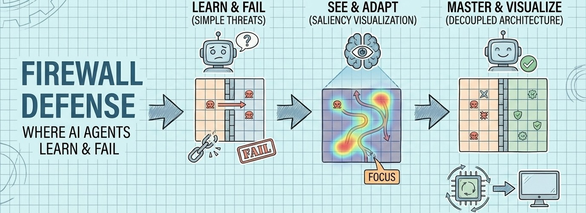
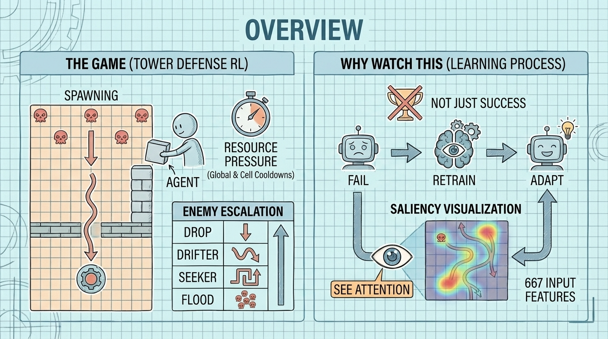
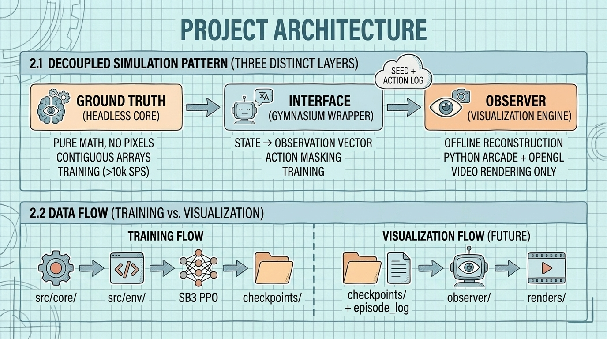

<!--
---
title: "Grid Defense RL"
description: "A Gymnasium reinforcement learning environment with saliency visualization for watching agents learn, fail, and adapt"
author: "VintageDon"
date: "2026-01-04"
version: "1.0"
status: "Active"
tags:
  - type: project-root
  - domain: ai-ml
  - tech: [python, numpy, gymnasium, stable-baselines3, ppo]
related_documents:
  - "[Design Document](docs/design-document.md)"
  - "[Grid Defense Spec v2](scratch/grid-defense-spec-v2.md)"
repository: https://github.com/radioastronomyio/firewall-defense-agentic-gaming
---
-->

# Grid Defense RL



[](https://python.org)
[](https://numpy.org/)
[](https://pytorch.org/)
[](https://gymnasium.farama.org/)
[](https://stable-baselines3.readthedocs.io/)
[](LICENSE)

> A Gymnasium reinforcement learning environment where you watch a PPO agent learn to defend a grid—then break when new challenges appear—then adapt.

Grid Defense RL is a custom [Gymnasium](https://gymnasium.farama.org/) environment designed for training and visualizing reinforcement learning agents. A PPO agent (via [Stable-Baselines3](https://stable-baselines3.readthedocs.io/)) learns to place defensive walls on a 13×9 grid to block enemies moving toward a core. What makes this project different is the focus on *watching* the learning process: a saliency visualization system shows what the agent is paying attention to at each decision, making the "black box" transparent.

This isn't a game you play—it's a training environment you observe. The architecture separates fast headless training (>10k steps/sec) from pretty visualization (60fps with overlays), so you can train efficiently and render watchable content afterward. The result is educational material showing RL concepts in action: curriculum learning, policy adaptation, and explainable AI through attention mapping.

Whether you're learning RL, building educational content, or looking for a well-documented Gymnasium environment to study or extend, this project is designed as an open learning lab with full documentation of design decisions, multi-model research synthesis, and reproducible training pipelines.

📄 This README is a concise overview. For the full technical specification including observation/action space details, reward structures, and implementation contracts, see the [Design Document](docs/design-document.md).

---

## 📊 Project Status

| Phase | Status | Description |
|-------|--------|-------------|
| Specification | ✅ Complete | v0.2 with multi-model synthesis (GDR + GPT + Claude) |
| Repository Setup | ✅ Complete | Structure, documentation, memory bank |
| Prototype | 🔄 Next | `GridDefenseEnv` with Drop enemy, >10k SPS target |
| Drop Training | ⬜ Planned | PPO baseline, episode recording |
| Curriculum | ⬜ Planned | Drifter introduction, failure capture, mixed training |
| Saliency | ⬜ Planned | Perturbation-based visualization |
| Video Production | ⬜ Planned | Observer layer, rendered output |

---

## 🔭 Overview



### The Game

Enemies spawn at the top of a 13×9 grid and move downward toward a core at the bottom. The agent places walls to block them. That's it—tower defense reduced to its simplest form.

But there's resource pressure. Walls have cooldowns: a global cooldown prevents spam, and each cell has its own cooldown after a wall is placed there. The agent can't just react—it has to predict where threats will be and commit to geometric decisions.

Enemies escalate in complexity through a curriculum:

| Enemy | Movement | Challenge |
|-------|----------|-----------|
| Drop | Straight down | Basic tracking—place wall in column |
| Drifter | Down + lateral drift | Coverage—point defense isn't enough |
| Seeker | Pathfinds around walls | Maze building—blocking reroutes, doesn't stop |
| Flood | Swarm behavior | Crowd control—blocking one gap increases pressure elsewhere |

### The Training Pipeline

The environment follows the standard Gymnasium interface, making it compatible with any RL library that supports Gymnasium. The default training path uses Stable-Baselines3's PPO implementation with action masking (via SB3-Contrib's MaskablePPO) to prevent the agent from exploring invalid actions.

Training runs headless at >10,000 steps per second. Episode logs (just the random seed and action sequence) are saved for later reconstruction by the visualization layer. This decoupling means training speed isn't limited by rendering.

### Curriculum Learning and Saliency

Most RL demos show success. This project shows *transitions*.

Train an agent on Drop enemies until it's competent. Then introduce Drifter. The agent fails—it learned to track vertical movement, but Drifter drifts horizontally. This failure is the interesting part. The saliency visualization shows the agent "looking in the wrong place," still focused on columns while threats slide sideways.

Retrain on mixed enemies. The saliency shifts—now the agent tracks lateral movement too. That moment of visible adaptation is the educational payload: not just "agent got better" but "here's specifically what changed in how it processes the world."

Saliency computation is cheap because the observation space is 667 features, not pixels. Perturbing each feature and measuring how much the agent's action distribution changes takes under a millisecond on modern hardware. The result maps back to the grid as a real-time overlay showing threat tracking, resource awareness, and strategic focus.

---

## 🎯 Target Audience

| Audience | Use Case |
|----------|----------|
| ML Learners | Watch RL training with xAI visualization, study Gymnasium environment design |
| RL Practitioners | Examine curriculum learning, action masking, and saliency methods |
| Content Creators | Fork for educational YouTube/streaming content |
| Developers | Use as a template for custom Gymnasium environments with visualization |

---

## 🏗️ Architecture

The system separates *training* from *visualization* completely. This is the key architectural decision.



### Three Decoupled Layers

| Layer | What It Does | When It Runs |
|-------|--------------|--------------|
| Ground Truth | Pure NumPy simulation. Grid state, enemy positions, collision detection. No rendering, no dependencies beyond NumPy. | Training (>10k steps/sec) |
| Interface | Gymnasium wrapper. Translates grid state into a normalized 667-feature observation vector. Handles action masking. | Training |
| Observer | Reconstructs episodes from seed + action log. Renders at 60fps with saliency overlay. Python Arcade + OpenGL. | Video production only |

### Why Decouple?

Rendering at 60fps caps training at ~100 steps per second. Decoupling means we train fast (targeting >10,000 steps/sec headless) and render pretty afterward. The Observer never runs during training—it reconstructs episodes from compact logs for video production.

This also means visualization can evolve independently. Shader effects, UI overlays, saliency methods—all can change without touching the training pipeline.

---

## 🔬 Technical Specifications

| Attribute | Value |
|-----------|-------|
| Grid dimensions | 13×9 (117 cells) |
| Coordinate convention | Arrays `(H, W)` = `(9, 13)`, indexed `[y, x]` |
| Position system | Fixed-point half-cell integers |
| Observation size | 667 features |
| Action space | 118 discrete (NO-OP + 117 cell placements) |
| Target headless SPS | >10,000 |
| Enemy slots | 20 (fixed, zero-padded) |
| Reward | +1 kill, -1 breach, 0 otherwise |

---

## 📁 Repository Structure

```
firewall-defense-agentic-gaming/
├── src/                  # Source code
│   ├── core/             # Headless simulation (grid, enemies, walls)
│   ├── env/              # Gymnasium wrapper
│   └── tests/            # Test suite + benchmarks
├── notebooks/            # Experimentation and analysis
├── configs/              # Training hyperparameters (YAML)
├── scripts/              # Training entrypoints
├── renders/              # Video output (gitignored)
├── docs/                 # Documentation
│   ├── design-document.md
│   └── documentation-standards/
├── scratch/              # Working documents
├── work-logs/            # Phase documentation
└── .kilocode/            # AI agent context
```

---

## 🚀 Getting Started

### For Contributors

1. Clone the repository
2. Review [Design Document](docs/design-document.md) for technical specification
3. Check [work-logs/](work-logs/) for current phase status

### Quick Start

```bash
# Clone
git clone https://github.com/radioastronomyio/firewall-defense-agentic-gaming.git
cd firewall-defense-agentic-gaming

# Create environment
python -m venv .venv
source .venv/bin/activate  # Windows: .venv\Scripts\activate

# Install (when available)
pip install -e .

# Run random agent benchmark (when available)
python -m src.tests.test_env
```

---

## 🤝 OSS Program Support

This repository benefits from open source programs that provide tooling to qualifying public repositories.

### Active Programs

| Program | Provides | Use Case |
|---------|----------|----------|
| [Greptile](https://greptile.com) | AI code review | PR review and code understanding |
| [Atlassian](https://www.atlassian.com/software/views/open-source-license-request) | Jira, Confluence | Project tracking and documentation |

### Available for Future Use

| Program | Provides | Planned Use |
|---------|----------|-------------|
| [Snyk](https://snyk.io/plans/) | Security scanning | Dependency vulnerability detection |
| [SonarCloud](https://www.sonarsource.com/open-source-editions/) | Code quality | Static analysis |

---

## 🌟 Open Science Philosophy

This project practices open methodology:

- Multi-model synthesis — Design decisions emerged from GDR research, GPT architecture review, and Claude orchestration. The process is documented in work logs.
- Reproducible research — Specs, seeds, and action logs enable exact reproduction of any training run or episode.
- Learning lab — This is a teaching tool. Mistakes and iterations are captured in work logs, not hidden. Fork it, break it, learn from it.

---

## 📄 License

This project is licensed under the MIT License — see [LICENSE](LICENSE) for details.

---

## 🙏 Acknowledgments

This project builds on excellent open source work:

| Project | Description | Repository |
|---------|-------------|------------|
| Gymnasium | RL environment API standard (Farama Foundation) | [Farama-Foundation/Gymnasium](https://github.com/Farama-Foundation/Gymnasium) |
| Stable-Baselines3 | Reliable RL algorithm implementations | [DLR-RM/stable-baselines3](https://github.com/DLR-RM/stable-baselines3) |
| SB3-Contrib | MaskablePPO and experimental algorithms | [Stable-Baselines-Team/stable-baselines3-contrib](https://github.com/Stable-Baselines-Team/stable-baselines3-contrib) |
| NumPy | Array computing foundation | [numpy/numpy](https://github.com/numpy/numpy) |
| PyTorch | Deep learning framework | [pytorch/pytorch](https://github.com/pytorch/pytorch) |
| Python Arcade | 2D game library (future visualization) | [pythonarcade/arcade](https://github.com/pythonarcade/arcade) |

---

Last Updated: 2026-01-04 | Prototype Phase
