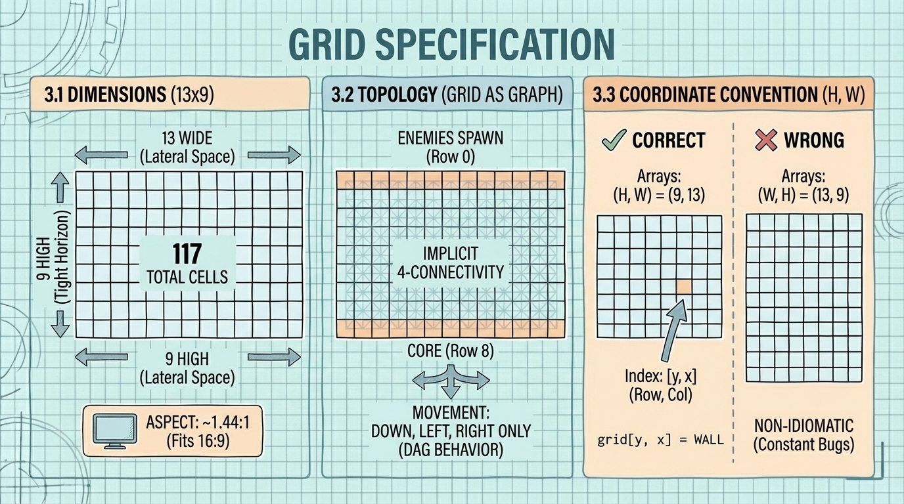
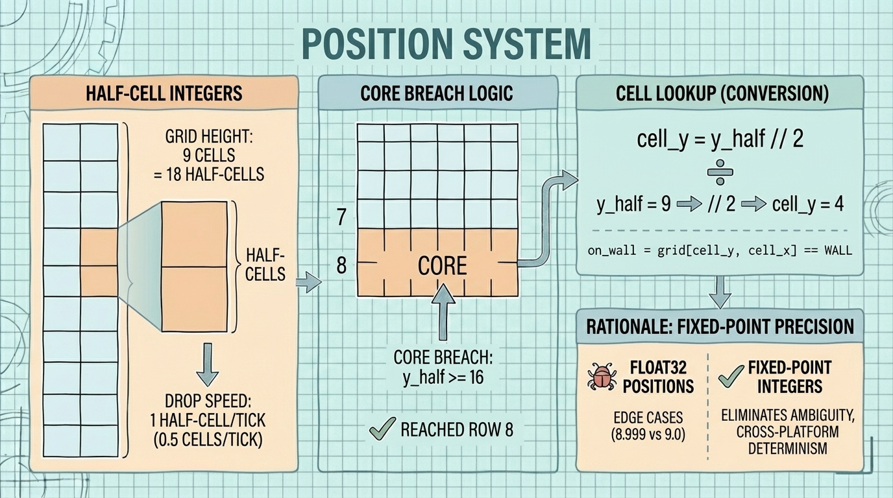
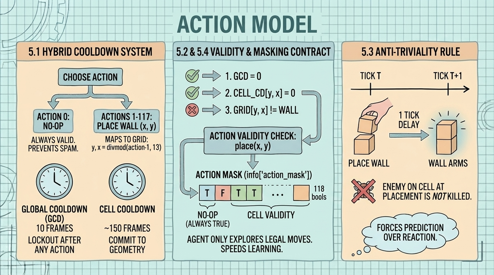
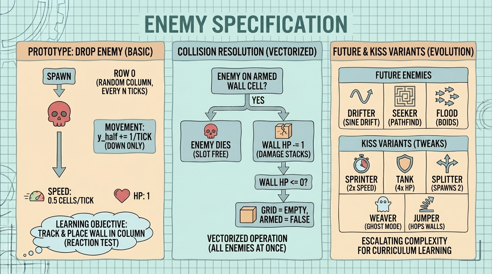
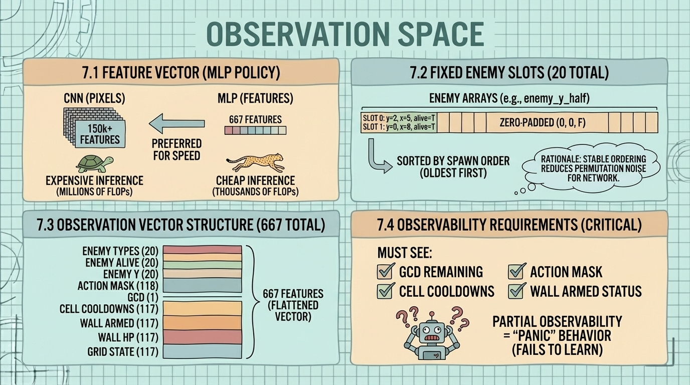

<!--
---
title: "Grid Defense RL - Design Document"
description: "Complete technical specification for the Grid Defense RL environment"
author: "VintageDon"
date: "2026-01-04"
version: "0.2"
status: "Active"
tags:
  - type: specification
  - domain: core-engine
  - tech: [python, numpy, gymnasium, stable-baselines3]
related_documents:
  - "[Repository README](../README.md)"
  - "[Architecture](../.kilocode/rules/memory-bank/architecture.md)"
repository: https://github.com/radioastronomyio/firewall-defense-agentic-gaming
---
-->

# Grid Defense RL - Design Document

This document is the authoritative technical specification for the Grid Defense RL environment. It consolidates seed research from the human developer, Gemini Deep Research, architecture review from GPT-5.2, and a final Human-in-the-loop review and synthesis in pair w/Claude Opus 4.5 into a single buildable contract.

Version: 0.2  
Status: Draft - Pre-prototype  
Last Updated: 2026-01-04

---

## Table of Contents

1. [Vision](#1-vision)
2. [Architecture](#2-architecture)
3. [Grid Specification](#3-grid-specification)
4. [Position System](#4-position-system)
5. [Action Model](#5-action-model)
6. [Enemy Specification](#6-enemy-specification)
7. [Observation Space](#7-observation-space)
8. [Reward Structure](#8-reward-structure)
9. [Step Ordering](#9-step-ordering)
10. [Data Layout](#10-data-layout)
11. [Saliency Method](#11-saliency-method)
12. [Prototype Scope](#12-prototype-scope)
13. [Curriculum Plan](#13-curriculum-plan)
14. [Open Questions](#14-open-questions)
15. [Multi-Model Synthesis](#15-multi-model-synthesis)

---

## 1. Vision

A grid-based defense game where a PPO agent learns to block incoming threats, with live saliency visualization showing what the agent attends to. Designed for educational content demonstrating RL + xAI concepts in bite sized chunks. Originally designed as a small YouTube series with 15m episodes, it seeks to break the RL process down into digestible, scalable chunks.

Core concept: Grid pathfinding with adversarial traffic and a learning defender. The cybersecurity "firewall" framing is thematic wrapper, not technical simulation.

Content hook: "Watch an agent break, then adapt." The interesting moments are transitions—agent trained on Drop fails when Drifter appears. Saliency shows it "looking in the wrong place." Retrain, saliency shifts. That's the episode arc.

Why this project:

- Intersection of gaming, RL, and xAI in one simple package
- Grid-as-graph simplifies state representation
- built in, decoupled 4k rendering engine for saliency visualization with a 'stats sidebar'
- Curriculum learning creates natural episode arcs
- Small enough to validate in one coding session
- Build specifically to leverage modern coding bots and AI-assisted development

---

## 2. Architecture


### 2.1 Decoupled Simulation Pattern

Three distinct layers that never overlap:

| Layer | Role | Runtime |
|-------|------|---------|
| Ground Truth | Headless NumPy core. Pure math, no pixels. Contiguous arrays for enemies. | Training (>10k SPS) |
| Interface | Gymnasium wrapper. Translates state → normalized observation vector. | Training |
| Observer | Offline "hallucination engine." Reconstructs from seed + action log. Python Arcade + OpenGL. | Video rendering only |

Why this matters: Rendering at 60fps caps training at ~100 SPS. Decoupling lets us train fast and render pretty stuff separately.

### 2.2 Data Flow

```
Training:
  src/core/ → src/env/ → SB3 PPO → checkpoints/

Visualization (future):
  checkpoints/ + episode_log → observer/ → renders/
```

---

## 3. Grid Specification



### 3.1 Dimensions: 13×9

| Metric | Value | Justification |
|--------|-------|---------------|
| Width | 13 | Odd number allows centered core. Lateral maneuver space. |
| Height | 9 | Keeps reward horizon tight. ~104 max steps at 0.5 cells/tick. |
| Total cells | 117 | Manageable state space for fast convergence. |
| Aspect | ~1.44:1 | Fits 16:9 video with room for sidebars. |

Mathematical basis: PPO effective horizon with γ=0.99, λ=0.95 is ~100 steps. Max snaking path through 13×9 at 50% fill ≈ 104 steps. Action-reward link remains within learnable horizon.

### 3.2 Topology

- Grid IS graph—lattice with implicit 4-connectivity
- Cells are nodes, adjacency is edges (no explicit edge definition)
- Enemies spawn row 0, core at row 8
- Movement constraint: down, left, right only (never up)—DAG behavior

### 3.3 Coordinate Convention

Arrays use `(H, W)` shape = `(9, 13)` and index as `[y, x]`.

This matches idiomatic NumPy / image convention where:

- First axis = rows = y (vertical, 0 at top)
- Second axis = columns = x (horizontal, 0 at left)

```python
# Correct
grid = np.zeros((9, 13), dtype=np.int8)  # (H, W)
grid[y, x] = WALL  # row y, column x

# Wrong (causes constant bugs)
grid = np.zeros((13, 9), dtype=np.int8)  # (W, H) - non-idiomatic
```

---

## 4. Position System



Positions use half-cell integers to eliminate float ambiguity.

| Concept | Value |
|---------|-------|
| Grid height | 9 cells = 18 half-cells |
| Drop speed | 1 half-cell per tick (0.5 cells/tick) |
| Core breach | `y_half >= 16` (reached row 8) |
| Cell lookup | `cell_y = y_half // 2` |

```python
# Movement (all enemies at once)
enemy_y_half[enemy_alive] += speed_half  # integer arithmetic, no floats

# Cell lookup for collision
cell_y = enemy_y_half // 2
cell_x = enemy_x
on_wall = grid[cell_y, cell_x] == WALL
```

Rationale: Float32 positions cause edge cases at boundaries (8.9999 vs 9.0). Fixed-point eliminates this bug class entirely and improves cross-platform determinism.

---

## 5. Action Model



### 5.1 Hybrid Cooldown System

| Mechanism | Value | Purpose |
|-----------|-------|---------|
| Action 0 | NO-OP | Always valid. Prevents forced spam when all cells on cooldown. |
| Actions 1-117 | Place wall at (x, y) | Subject to validity checks. Action index maps: `y, x = divmod(action - 1, 13)` |
| Global Cooldown (GCD) | 10 frames | Lockout after any action. Prevents toggle-juggling. |
| Cell Cooldown | ~150 frames (~5s at 30 ticks/s) | Commit to geometric decisions. |
| Action Masking | Invalid actions masked | Agent never explores illegal moves. Speeds early learning. |

### 5.2 Action Mask Contract

The action mask is provided in two locations:

1. `info["action_mask"]` — Primary interface for SB3-contrib MaskablePPO
2. Observation vector — Included for saliency visualization (agent can "see" what's legal)

```python
# In step() return:
info = {
    "action_mask": self._get_action_mask()  # np.ndarray, shape (118,), dtype=bool
}

# Mask structure:
# mask[0] = True (NO-OP always valid)
# mask[1:118] = validity of each cell placement
```

### 5.3 Anti-Triviality Rule

Walls arm 1 tick after placement. Enemy on cell at placement time is not killed.

*Rationale:* Prevents "whack-a-mole" reflex policy. Forces prediction over reaction. More general than spawn-row exclusion or occupied-cell exclusion.

### 5.4 Action Validity

An action `place(x, y)` is valid iff:

1. GCD = 0
2. cell_cooldown[y, x] = 0
3. grid[y, x] != WALL (no double-stacking)

Invalid actions are masked. Agent sees mask in observation.

---

## 6. Enemy Specification



### 6.1 Prototype Enemy: Drop

| Attribute | Value |
|-----------|-------|
| Movement | `y_half += 1` per tick (down only) |
| Speed | 0.5 cells/tick = 1 half-cell/tick |
| HP | 1 |
| Collision | Dies on contact with armed wall. Wall HP -= 1. |
| Spawn | Row 0 (y_half = 0), random column, every N ticks |

Learning objective: Agent learns that placing a wall in the column kills the enemy. Simple reaction test.

### 6.2 Collision Resolution

When enemies collide with walls:

1. Check all alive enemies against grid
2. For each enemy on an armed wall cell: enemy dies, wall takes 1 damage
3. Multiple enemies on same wall: Damage stacks. Wall HP -= count of enemies on cell.
4. Wall dies when HP ≤ 0

```python
# Vectorized collision
enemy_cells_y = enemy_y_half[alive] // 2
enemy_cells_x = enemy_x[alive]
on_wall = (grid[enemy_cells_y, enemy_cells_x] == WALL) & wall_armed[enemy_cells_y, enemy_cells_x]

# Damage walls (handles multiple enemies per cell)
for y, x in zip(enemy_cells_y[on_wall], enemy_cells_x[on_wall]):
    wall_hp[y, x] -= 1
    if wall_hp[y, x] <= 0:
        grid[y, x] = EMPTY
        wall_armed[y, x] = False

# Kill enemies that hit walls
enemy_alive[alive][on_wall] = False
```

### 6.3 Future Enemies (Not in Prototype)

| Type | Movement | Test |
|------|----------|------|
| Drifter | Down + sinusoidal lateral drift | Coverage—point defense insufficient |
| Seeker | Dijkstra flow field toward core, pathfinds around walls | Maze building—blocking re-routes, must extend path |
| Flood | Boids (separation + cohesion + alignment) | Crowd control—blocking one hole increases pressure elsewhere |

### 6.4 KISS Variants (Parameter Tweaks)

| Variant | Modification | Effect |
|---------|--------------|--------|
| Sprinter | 2x speed, 0.5x HP | Punishes greedy cooldown usage |
| Tank | 0.5x speed, 4x HP | Forces stalling tactics |
| Splitter | On death, spawns 2 Drifters | Punishes killing near core |
| Weaver | Periodic ghost mode (no collision) | Forces layered defense |
| Jumper | Moves 2 half-cells/tick | Hops single-layer walls |

---

## 7. Observation Space

### 7.1 Feature Vector (Not Pixels)

MLP policy, not CNN. Keeps inference cheap (~thousands of FLOPs vs millions for convolutions).

### 7.2 Fixed Enemy Slots

20 enemy slots, zero-padded, sorted by spawn order (oldest first).

*Rationale:* Variable-length observations introduce permutation noise. Fixed slots with stable ordering give the network consistent input structure.

```python
MAX_ENEMIES = 20

# Enemy arrays are always shape (MAX_ENEMIES,)
enemy_y_half = np.zeros(MAX_ENEMIES, dtype=np.int16)
enemy_x = np.zeros(MAX_ENEMIES, dtype=np.int16)
enemy_alive = np.zeros(MAX_ENEMIES, dtype=bool)
enemy_type = np.zeros(MAX_ENEMIES, dtype=np.uint8)
enemy_spawn_order = np.zeros(MAX_ENEMIES, dtype=np.uint16)
```

### 7.3 Observation Vector Structure

| Feature | Shape | Description |
|---------|-------|-------------|
| Grid state | 117 | Cell contents: 0=empty, 1=wall (flattened `[y, x]` order) |
| Wall HP | 117 | HP per cell, 0 if no wall |
| Wall armed | 117 | 1 if armed, 0 otherwise |
| Cell cooldowns | 117 | Ticks until cell available (normalized) |
| GCD remaining | 1 | Ticks until any action allowed (normalized) |
| Action mask | 118 | Valid actions (NO-OP + 117 cells) |
| Enemy y positions | 20 | Half-cell y, normalized to [0, 1] |
| Enemy x positions | 20 | Cell x, normalized to [0, 1] |
| Enemy alive | 20 | 1 if alive, 0 if slot empty |
| Enemy types | 20 | Type ID (0 = empty/Drop, future types 1+) |

Total: 117×4 + 1 + 118 + 20×4 = 667 features

### 7.4 Observability Requirements

Agent MUST see:

- GCD remaining
- Cell cooldowns
- Current action mask
- Wall armed status

Without these, agent has partial observability and exhibits "panic" behavior.

---

## 8. Reward Structure



### 8.1 Prototype Rewards

| Event | Reward |
|-------|--------|
| Enemy reaches row 8 (core breach) | -1.0 |
| Enemy killed by wall | +1.0 |
| Tick survived | 0 (no shaping yet) |

### 8.2 Shaping (Deferred)

Options if training flatlines:

- Small per-tick survival bonus (+0.001)
- Distance-from-core shaping (enemy at row 5 = less negative than row 7)

Decision: Start binary. Add shaping only if convergence fails. Avoid polluting signal prematurely.

---

## 9. Step Ordering

Deterministic ordering enables replay from seed + action log:

```
1. Decrement cooldowns (GCD, all cell cooldowns)
2. Apply action (if valid and GCD was 0)
3. Arm walls placed last tick (wall_pending → wall_armed)
4. Move enemies (y_half += speed_half)
5. Resolve collisions (wall damage, enemy death)
6. Check core breach (any enemy with y_half >= 16)
7. Spawn new enemies (if spawn tick)
8. Compact enemy arrays (remove dead, maintain spawn order)
9. Compute reward
10. Check done condition (core breach or max ticks)
11. Build observation + action_mask
12. Return obs, reward, terminated, truncated, info
```

---

## 10. Data Layout

### 10.1 State Arrays

| Array | Dtype | Shape | Notes |
|-------|-------|-------|-------|
| `grid` | int8 | (9, 13) | 0=empty, 1=wall. Index as `[y, x]`. |
| `wall_hp` | uint8 | (9, 13) | 0 if no wall |
| `wall_armed` | bool | (9, 13) | False until 1 tick after placement |
| `wall_pending` | bool | (9, 13) | True on placement tick, becomes armed next tick |
| `cell_cd` | uint16 | (9, 13) | Cooldown ticks remaining |
| `gcd` | uint16 | scalar | Global cooldown remaining |

### 10.2 Enemy Arrays (Fixed Size)

| Array | Dtype | Shape | Notes |
|-------|-------|-------|-------|
| `enemy_y_half` | int16 | (20,) | Half-cell y position. Cell = y_half // 2. |
| `enemy_x` | int16 | (20,) | Cell x position (integer, no sub-cell) |
| `enemy_alive` | bool | (20,) | Active mask |
| `enemy_type` | uint8 | (20,) | Type ID (0 = Drop) |
| `enemy_spawn_tick` | uint32 | (20,) | Tick when spawned (for stable ordering) |

### 10.3 Vectorized Operations

No OOP enemies. All updates are array operations:

```python
# Movement
enemy_y_half[enemy_alive] += speed_half

# Collision detection
cell_y = enemy_y_half[enemy_alive] // 2
cell_x = enemy_x[enemy_alive]
on_armed_wall = (grid[cell_y, cell_x] == WALL) & wall_armed[cell_y, cell_x]

# Core breach detection
breached = enemy_y_half[enemy_alive] >= CORE_Y_HALF  # 16 for 9-high grid
```

---

## 11. Saliency Method

### 11.1 Why It's Feasible

Observation is ~667 features, not 150k pixels. Perturbation saliency requires N forward passes where N = feature count. On modern GPU, batch inference of 667 samples through small MLP < 1ms.

### 11.2 Method: Vector Perturbation Sensitivity

1. Base inference: get action distribution P_base from observation O
2. Batch perturbation: create O_batch where row i = O with feature i zeroed
3. Batch inference: get P_perturbed for all perturbations
4. Divergence: KL(P_base || P_perturbed[i]) = saliency for feature i
5. Map back to grid for visualization

### 11.3 Semantic Channels

| Channel | Features | Shows |
|---------|----------|-------|
| Threat | Enemy positions | "What is the agent tracking?" |
| Strategic | Wall states, cooldowns | "What resources is it managing?" |
| Temporal | GCD, cell cooldowns | "What timing is it considering?" |

---

## 12. Prototype Scope

### 12.1 In Scope

| Component | Deliverable |
|-----------|-------------|
| Grid state | (9, 13) NumPy arrays, `[y, x]` indexing |
| Drop enemy | Vectorized down-only movement, fixed-point positions |
| Walls | Placement, cooldown, 1-tick arming, HP, collision stacking |
| Action model | NO-OP + 117 place actions, GCD + cell CD, masking in info dict |
| Gymnasium env | `GridDefenseEnv` with step/reset/render(mode='ansi') |
| Random agent | Verify loop works, measure SPS |

### 12.2 Out of Scope (Prototype)

- Visualization layer (Python Arcade)
- Saliency computation
- Other enemy types
- PPO training
- Episode recording/replay

### 12.3 Success Criteria

| Metric | Target |
|--------|--------|
| Headless SPS | > 10,000 |
| Gymnasium compliance | Passes `check_env()` |
| Determinism | Same seed + actions = same trajectory |
| Random agent | Runs 1000 episodes without crash |

---

## 13. Curriculum Plan

| Phase | Content | Agent State |
|-------|---------|-------------|
| 1 | Grid + Drop | Train from scratch |
| 2 | Introduce Drifter | Test Drop-trained agent (expect failure) |
| 3 | Train on Drop + Drifter mixed | Observe saliency shift |
| 4 | Introduce Seeker | Test mixed-trained agent |
| 5 | Full mix + stress test | Final trained agent |

Narrative arc: Not "watch agent get good" but "watch agent break, then adapt."

---

## 14. Open Questions

| Question | Default | Notes |
|----------|---------|-------|
| Wall HP value? | 1 | May need tuning for Tank enemies |
| Max enemies? | 20 | Scale with difficulty if needed |
| Spawn rate? | 30 ticks (~1/sec) | Tunable per episode |
| Episode length? | 1000 ticks or core breach | |
| GCD / speed balance? | 10 frames / 0.5 cells | May need tuning for "interesting" Drop training |

---

## 15. Multi-Model Synthesis

This specification emerged from multi-model collaboration:

### 15.1 GDR (Gemini Deep Research) - Round 1

- Recommended 13×9 grid (PPO horizon math)
- Recommended hybrid cooldown model (GCD + cell CD + masking)
- Recommended vector perturbation saliency
- Provided enemy behavior specs and episode arc outline

### 15.2 GDR - Round 2

- Implementation refinement with v0.2 spec as anchor
- Code examples for vectorized operations
- Edge case identification

### 15.3 GPT-5.2 Review - Round 1

Validated architecture. Added three mandatory changes:

| Flag | Resolution |
|------|------------|
| NO-OP action | Added as action 0, always valid |
| Anti-triviality rule | Walls arm 1 tick after placement |
| Sparse reward shaping | Deferred—start binary, add if needed |

### 15.4 GPT-5.2 Review - Round 2

Implementation-level review. Five changes incorporated:

| Issue | Resolution |
|-------|------------|
| Axis order | Flipped to `(H, W)` = `(9, 13)`, index `[y, x]` |
| Float positions | Changed to fixed-point half-cell integers |
| Variable enemy count | Fixed 20 slots, zero-padded, spawn-order sorted |
| Action mask contract | Added to `info["action_mask"]` + observation |
| Multi-enemy collision | Damage stacks, wall dies at HP ≤ 0 |

### 15.5 Claude (Orchestrator)

- Synthesized multi-model inputs
- Maintained scope boundaries
- Drafted spec revisions
- Documentation and repository scaffolding

---

## Document Info

| | |
|---|---|
| Author | VintageDon |
| Created | 2026-01-04 |
| Updated | 2026-01-04 |
| Version | 0.2 |
| Status | Draft - Pre-prototype |

---

## Sources

- GDR Deep Dive: Grid Defense RL Environment Design (2026-01-04)
- GDR Round 2: Implementation Refinement (2026-01-04)
- GPT-5.2 Review Round 1: Architecture validation
- GPT-5.2 Review Round 2: Implementation fixes
- Neon Warlords architecture reference (decoupled simulation pattern)
