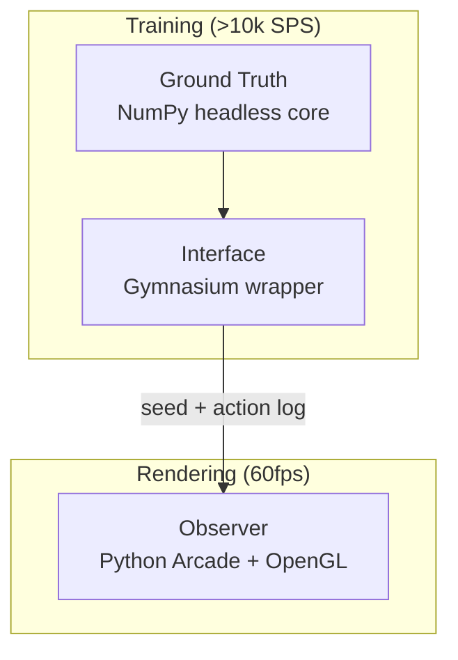

<!--
---
title: "[Project Name]"
description: "One-line description"
author: "VintageDon"
date: "YYYY-MM-DD"
version: "1.0"
status: "Active"
tags:
  - type: project-root
  - domain: [primary-domain]
  - tech: [key-technologies]
related_documents:
  - "[Related Link](url)"
repository: https://github.com/radioastronomyio/firewall-defense-agentic-gaming
---
-->

# 🎯 [Project Name]


<!-- 
BADGES: 
- Include technology badges relevant to the project
- Include active OSS tool badges (Greptile, Snyk) that directly affect the repo
- Do NOT include project management tools (Atlassian) — those go in OSS Program Support section only
-->
[](https://python.org)
[](https://gymnasium.farama.org/)
[](https://stable-baselines3.readthedocs.io/)
[](LICENSE)

> One-line description that captures the essence of the project.

[2-3 sentences expanding on what this project is, what it does, and why it exists. This is your elevator pitch.]

---

## 🔭 Background

This section provides context for [domain/problem space]. If you're already familiar with [key concepts], skip to [Quick Start](#-quick-start).


[2-4 paragraphs explaining the context, problem space, and motivation for this project. What gap does it fill? What inspired it? Include domain-specific background that newcomers need.]

---

## 🎯 Target Audience

| Audience | Use Case |
|----------|----------|
| ML Learners | Watch RL training with xAI visualization |
| RL Practitioners | Study curriculum learning and saliency methods |
| Content Creators | Fork for educational YT/streaming content |

---

## 🏗️ Architecture

### Decoupled Simulation Pattern



| Layer | Role | Runtime |
|-------|------|---------|
| **Ground Truth** | Headless NumPy core. Pure math, no pixels. | Training |
| **Interface** | Gymnasium wrapper. State → normalized observation. | Training |
| **Observer** | Offline renderer. Reconstructs from seed + actions. | Video only |

---

## 📊 Project Status

| Area | Status | Description |
|------|--------|-------------|
| Specification | ✅ Complete | v0.2 spec with multi-model synthesis |
| Prototype | 🔄 In Progress | GridDefenseEnv with Drop enemy |
| PPO Training | ⬜ Planned | After prototype validation |
| Saliency | ⬜ Planned | Phase 4 |

---

## 📁 Repository Structure

```markdown
firewall-defense-agentic-gaming/
├── 📂 src/               # Source code
│   ├── core/             # Headless simulation
│   ├── env/              # Gymnasium wrapper
│   └── tests/            # Test suite
├── 📂 notebooks/         # Experimentation
├── 📂 configs/           # Hyperparameters
├── 📂 scripts/           # Training entrypoints
├── 📂 renders/           # Video output (gitignored)
├── 📚 docs/              # Documentation
├── 📄 LICENSE
└── 📄 README.md          # This file
```

---

## 🔬 Technical Specifications

| Attribute | Value |
|-----------|-------|
| Grid size | 13×9 (117 cells) |
| Observation | 667 features (MLP policy) |
| Action space | 118 (NO-OP + 117 cell placements) |
| Target SPS | >10,000 headless |

---

## 🤝 OSS Program Support

This repository benefits from open source programs that provide tooling to qualifying public repositories.

### Active Programs

| Program | Provides | Use Case |
|---------|----------|----------|
| [Greptile](https://greptile.com) | AI code review | PR review |
| [Atlassian](https://www.atlassian.com/software/views/open-source-license-request) | Jira, Confluence | Project tracking |

### Available for Future Use

| Program | Provides | Planned Use |
|---------|----------|-------------|
| [Snyk](https://snyk.io/plans/) | Security scanning | Dependency vulnerability detection |
| [SonarCloud](https://www.sonarsource.com/open-source-editions/) | Code quality | Static analysis |

---

## 🌟 Open Science Philosophy

We practice open science and open methodology:

- Research methodologies are fully documented and repeatable
- Multi-model synthesis (GDR, GPT, Claude) is captured in work logs
- Scripts and pipelines are published for community learning
- Learning processes are documented for educational content

---

## 🚀 Getting Started

### For Contributors

1. Clone the repository
2. Run `work-logs/01-ideation-and-setup/scaffold-repo.ps1`
3. Review [Grid Defense Spec v2](scratch/grid-defense-spec-v2.md)

### Quick Start

```bash
# Clone
git clone https://github.com/radioastronomyio/firewall-defense-agentic-gaming.git
cd firewall-defense-agentic-gaming

# Create environment
python -m venv .venv
source .venv/bin/activate  # or .venv\Scripts\activate on Windows

# Install dependencies (when available)
pip install -e .
```

---

## 📄 License

This project is licensed under the MIT License — see [LICENSE](LICENSE) for details.

---

## 🙏 Acknowledgments

- GDR (Gemini Deep Research) — Initial environment design research
- GPT-5.2 — Architecture validation and implementation review
- Open source community — Gymnasium, Stable-Baselines3, NumPy

---

Last Updated: [Date] | Prototype Phase

<!--
=============================================================================
TEMPLATE USAGE NOTES (remove this entire block when using)
=============================================================================

This template is customized for the Grid Defense RL project.

REQUIRED CHANGES WHEN USING:
1. Update frontmatter (title, description, date)
2. Replace [Project Name] with actual name
3. Update badges for your tech stack
4. Fill in Background section
5. Update Project Status table
6. Update Repository Structure if different
7. Update Getting Started commands

REPOSITORY FIELD:
Always include: repository: https://github.com/radioastronomyio/firewall-defense-agentic-gaming

=============================================================================
-->
